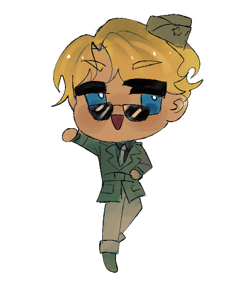

# ✈ USAAF: Voices From The Sky
> "Beneath the clouds they fought, beyond the stars they inspire."

 Welcome to a digital archive dedicated to preserving the words, memories, and encouragement left behind by pilots and personnel of the United States Army Air Forces (USAAF) during World War II.

---

## ※ What They Wanted to Tell Future Generations
This project aims to carry on the “spirit of courage” passed down by the previous generation — from legendary fighter aces to unnamed servicemen who lost their lives in the line of duty — in order to inspire and encourage people today to overcome the hardships of life.

---

## ✉ Message & Archive Categories
Click below to explore stories, memories, and messages of encouragement from different categories:

* [The Legends](./quotes/famous-pilots.md) — Stories, ideas, and reflections from the fighter aces whose names were etched into history
* [The Unsung Heroes](./quotes/unsung-heroes.md) — Quotes, records, and stories from ordinary soldiers, mechanics, and the forgotten people behind the scenes
* [In Memoriam](./quotes/last-letters.md) — Final letters and last messages from those who sacrificed their lives in service

---

## ➤ Become Part of the Memory
If you have records, letters, or messages from former USAAF personnel that you would like to share, please see [CONTRIBUTING.md](./CONTRIBUTING.md) for information on how to contribute to the project.